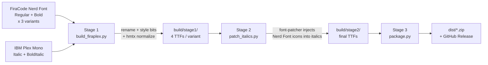

# FiraPlexCode

[](#about-this-project)
[](LICENSES.md)
[](LICENSES.md)

A merged programming font that combines:

- **FiraCode Nerd Font** Regular & Bold — for upright glyphs, programming ligatures, and the full Nerd Font icon set.
- **IBM Plex Mono** Italic & Bold Italic — to give FiraCode (which ships without italics) a real, well-designed italic style.

The output is a coherent 4-style RIBBI family (`Regular`, `Bold`, `Italic`, `Bold Italic`) that any OS / editor / terminal will recognize as one font. Italic styles are patched with the same Nerd Font icons so terminals, status lines, and prompts keep working when text is rendered in italics.

Three variants are produced, mirroring the upstream Nerd Fonts naming:

| Variant                        | Use it for                                          |
| ------------------------------ | --------------------------------------------------- |
| `FiraPlexCode Nerd Font`       | General editor use (icons may be slightly wide)     |
| `FiraPlexCode Nerd Font Mono`  | Terminals (icons forced to a single monospace cell) |
| `FiraPlexCode Nerd Font Propo` | UI / writing where icons should be proportional     |

## Pipeline



### Stage 1 — `scripts/build_firaplex.py`

Pure `fontTools`, no external deps. For each variant it produces 4 TTFs:

- **Regular / Bold**: copied directly from the upstream FiraCode Nerd Font (icons + ligatures preserved), with the `name`, `OS/2`, `head`, and `post` tables rewritten so they belong to the `FiraPlexCode` family.
- **Italic / Bold Italic**: copied from IBM Plex Mono, scaled from 1000 UPM up to FiraCode Nerd Font's 1950 UPM via `fontTools.ttLib.scaleUpem`, then hmtx-normalized to a 1200-unit monospace cell so the four styles share one coordinate system.

### Stage 2 — `scripts/patch_italics.py`

Drives the official [`nerd-fonts` font-patcher](https://github.com/ryanoasis/nerd-fonts) (FontForge) to inject the PUA icon ranges into the two italic styles, with the per-variant flag set:

| Variant  | Flags               |
| -------- | ------------------- |
| standard | `--complete`        |
| mono     | `--complete --mono` |
| propo    | `--complete --mono` |

`--complete` is mutually exclusive with `--variable-width-glyphs`, and there is no proportional Plex italic source — Plex Mono Italic is monospace. So the propo variant patches its italics with the mono icon set (full ~12k coverage), while keeping the upstream proportional FiraCode NF for Regular/Bold.

Regular/Bold are not re-patched (they came from the upstream FiraCode Nerd Font already), only re-stamped so their family name carries the variant suffix.

### Stage 3 — `scripts/package.py`

Zips each variant separately plus a combined `FiraPlexCode-all-<version>.zip`, embedding `LICENSES.md` and `README.md`.

### Verification — `scripts/verify.py`

Sanity checks every produced TTF: name records, fsSelection / macStyle / italicAngle bits, family-name prefix.

## Local build

Requirements:

- [`uv`](https://docs.astral.sh/uv/) (Python project/dependency manager)
- FontForge with Python bindings
  - macOS: `brew install fontforge`
  - Debian/Ubuntu: `apt install fontforge python3-fontforge`
  - Arch: `sudo pacman -S fontforge`
  - Windows: install FontForge from <https://fontforge.org/> and add it to `PATH`
- The `nerd-fonts` `font-patcher` script (download instructions below)

`uv` will fetch a pinned Python interpreter and the locked dependencies from `uv.lock` automatically — no system Python or virtualenv setup needed.

```bash
# 0. (One-time) Install uv if you don't have it.
#    See https://docs.astral.sh/uv/getting-started/installation/

# 1. Sync the locked Python toolchain + deps into a project-local .venv
uv sync --locked

# 2. Vendor the official Nerd Font patcher (~3 MB, includes the symbol fonts)
mkdir -p tools
curl -fL -o /tmp/FontPatcher.zip \
  https://github.com/ryanoasis/nerd-fonts/releases/download/v3.4.0/FontPatcher.zip
unzip -q /tmp/FontPatcher.zip -d tools/font-patcher

# 3. Download upstream sources (FiraCode NF + IBM Plex Mono)
uv run python scripts/fetch_sources.py
# If GitHub release downloads time out (China etc.), use a mirror:
#   GH_MIRROR=https://gh-proxy.com uv run python scripts/fetch_sources.py

# 4. Stage 1 — merge metadata
uv run python scripts/build_firaplex.py            # all variants
# uv run python scripts/build_firaplex.py --variant mono   # one variant

# 5. Stage 2 — inject Nerd Font icons into italics
uv run python scripts/patch_italics.py

# 6. Verify
uv run python scripts/verify.py

# 7. Package
uv run python scripts/package.py --version 1.0.0
ls dist/
```

To update locked dependencies after editing `pyproject.toml`:

```bash
uv lock        # refresh uv.lock
uv sync        # re-sync the venv
```

## Preview

Quickest way to see the result without installing system fonts:

```bash
python -m http.server 8000
# open http://localhost:8000/preview/ in a browser
```

The page lets you switch between the three variants, change size, and toggle ligatures. See `preview/README.md` for terminal/editor install snippets.

## Configuration

`config.json` controls upstream source versions, the family name, and per-variant patcher flags. Pin upstream versions there to keep builds reproducible:

```json
{
  "family_name": "FiraPlexCode",
  "version": "1.000",
  "sources": {
    "firacode_nerd_version": "v3.4.0",
    "ibm_plex_version": "v1.1.0"
  }
}
```

Bump `firacode_nerd_version` / `ibm_plex_version` and re-tag to absorb upstream updates.

## Why both Stage 1 _and_ Stage 2?

Two reasons we don't just feed Plex Mono Italic straight to `font-patcher`:

1. We need a **coherent 4-style family**. Stage 1 stamps the `name` table and style bits so all four files declare themselves as the same family with the right RIBBI subfamily. Without that, the OS would surface "FiraCode Nerd Font" and "IBM Plex Mono" as two separate families and italics wouldn't be selected automatically.
2. We need **Plex's italic shapes inside a font that re-uses FiraCode's metrics**. FiraCode Nerd Font v3.x uses 1950 UPM with a 1200-unit monospace cell, while Plex Mono ships at 1000 UPM / 600. Stage 1 scales Plex up via `fontTools.ttLib.scaleUpem` and re-centers each glyph in the 1200-unit cell so terminals stay aligned across all four styles.

Stage 2 then layers Nerd Font icons on top so italic terminal text still renders icons.

## Licenses

This repository ships **two layers of licensing** that apply at the same time:

| Layer                    | What it covers                                                              | License                |
| ------------------------ | --------------------------------------------------------------------------- | ---------------------- |
| Build scripts (this repo) | `scripts/`, `config.json`, `preview/`, build/CI tooling                     | **MIT**                |
| Produced font binaries   | Anything inside `dist/*.zip` or `build/stage2/*.ttf`                        | **OFL-1.1** (+ MIT)    |

The font binaries are derivative works of three upstream projects, and the OFL-1.1 forbids redistributing such derivatives under any other license — so the produced TTFs **must** travel under OFL-1.1, even though the scripts that build them are MIT. The Nerd Fonts patcher additions inside the binaries are MIT, which is OFL-1.1 compatible.

| Upstream           | License | Source                                    |
| ------------------ | ------- | ----------------------------------------- |
| FiraCode           | OFL-1.1 | <https://github.com/tonsky/FiraCode>      |
| IBM Plex Mono      | OFL-1.1 | <https://github.com/IBM/plex>             |
| Nerd Fonts patches | MIT     | <https://github.com/ryanoasis/nerd-fonts> |

See [`LICENSES.md`](LICENSES.md) for the full text of every license.

## About this project

This project is built with **vibe coding** — an AI-assisted, conversation-driven coding workflow. The Python pipeline, build orchestration, FontTools usage patterns, hinting/UPM debugging, and this README itself were authored in collaboration with an AI coding agent. Every change was reviewed, tested locally, and committed by a human; the role of the agent is closer to a fast pair-programmer than to a code generator.

If you spot something that looks AI-shaped (overly verbose docstring, an exotic library helper, an unusual workaround), feel free to open an issue — that kind of feedback is exactly what keeps vibe-coded projects honest.
